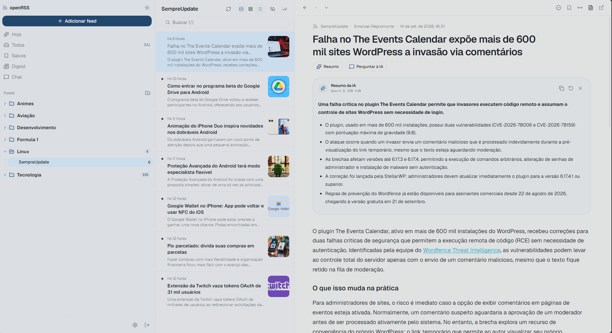
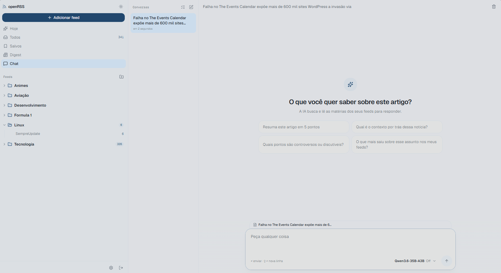

# openRSS

<p align="center">
  <strong>Leitor RSS self-hosted com IA integrada</strong><br>
  <em>Self-hosted RSS reader with built-in AI · Lector RSS self-hosted con IA integrada</em>
</p>

<p align="center">
  <a href="LICENSE"></a>
  <a href="https://github.com/paulocarinhena/openRSS/pkgs/container/openrss"></a>
  
  
</p>

<p align="center">
  <strong>Idioma / Language / Idioma:</strong>
  <a href="#português-brasil">Português</a> ·
  <a href="#english">English</a> ·
  <a href="#español">Español</a>
</p>

---

## Português (Brasil)

Leitor RSS self-hosted, simples e rápido, inspirado no Feedly — com IA integrada (OpenAI, Anthropic, OpenRouter ou qualquer API OpenAI-compatible, inclusive modelos locais via Ollama, LM Studio ou vLLM).

Feito para instâncias pequenas (até ~5 usuários simultâneos) em um único container com SQLite. Precisa de mais escala? Escolha **PostgreSQL** no assistente de instalação.

[](https://buymeacoffee.com/pcarinhena)

### Capturas de tela

| Leitor de artigos | Chat com IA |
|:---:|:---:|
|  |  |
| Modo leitura com Readability, resumo e navegação entre artigos | Converse com seus feeds — a IA busca e lê artigos por você |

### Principais recursos

**Leitura**
- Visão Hoje (priorizada por IA), Todos, Salvos, pastas e feeds individuais
- Visualizações em cartões, grade ou só títulos
- Modo artigo completo (Readability) e busca instantânea
- Notícias do mesmo fato publicadas por feeds diferentes aparecem agrupadas ("+N fontes"); ler uma marca as outras como lidas
- Apps nativos via API Google Reader e Fever (NetNewsWire, Reeder, ReadYou, FluentReader, Unread…) com senhas de aplicativo em Configurações → Apps
- Instalável como app (PWA) no celular e no desktop, com leitura offline dos artigos salvos e lidos recentemente
- Atalhos de teclado: `j`/`k` (navegar), `o` (abrir), `m` (marcar lido), `s` (salvar), `Shift+A` (marcar todos), `/` (buscar)

**Feeds**
- Descoberta automática a partir da URL do site
- Suporte a RSS, Atom e RDF
- Atualização em segundo plano com ETag/Last-Modified e backoff em erros
- Importação e exportação OPML
- Tags para organizar os artigos salvos
- Salvar qualquer link para ler depois (texto extraído em modo leitura): botão em Salvos, bookmarklet e menu Compartilhar do celular
- Painel de saúde dos feeds (Configurações → Saúde): com erro, parados, pouco lidos e ativos demais, com limpeza em lote
- Regras automáticas por título, conteúdo, autor, URL ou nota da IA: marcar como lido, salvar, destacar ou notificar (ntfy, Discord, Slack, Telegram, webhook)
- Retenção configurável de artigos

**Usuários**
- Autenticação por email e senha (Better Auth) e login único via OIDC (Authentik, Authelia, Keycloak…), com vinculação de contas existentes em Configurações → Geral
- O primeiro cadastro vira administrador
- Cadastro aberto ou fechado; admin pode criar usuários

**Temas**
- Light e Dark — veja [`docs/design/`](docs/design/)

### Integrações de IA

| Provedor | Base URL | Exemplo de modelo |
|---|---|---|
| OpenAI | opcional | `gpt-5-mini` |
| Anthropic | opcional | `claude-sonnet-5` |
| OpenRouter | opcional | `anthropic/claude-sonnet-5` |
| OpenAI-compatible | **obrigatória** (Ollama, LM Studio, vLLM…) | `llama3.2` |

**O que a IA faz no openRSS:**

- Resumir artigos em streaming, com cache
- Perguntas sobre o artigo direto no leitor
- Busca semântica (por assunto) nas listas e no chat, com embeddings de um provedor global (OpenAI, OpenRouter ou compatível, como Ollama)
- Digest diário dos não lidos, agrupado por tema (automático ou sob demanda), também por e-mail
- Chat com seus feeds — a IA busca e lê artigos via ferramentas
- Priorização de artigos novos (nota 0–100 com base nos seus interesses)
- Provedores globais (admin) e pessoais (cada usuário)
- Chaves de API criptografadas com AES-256-GCM

Configure em Configurações → IA → Adicionar. Use Testar para validar a conexão antes de salvar.

### Instalação

> Para agentes automatizados: siga os passos abaixo na ordem. Todos os comandos assumem um terminal com Git, Docker (Compose v2) ou Node.js 22.12+ instalado.

#### Pré-requisitos

- Docker (recomendado): Docker 24+ e Docker Compose v2
- Desenvolvimento local: Node.js ≥ 22.12 e npm ≥ 10

#### Método A — Docker + SQLite (recomendado)

```bash
git clone https://github.com/paulocarinhena/openRSS.git
cd openRSS
docker compose up -d --build
```

Aguarde 30–60 segundos e verifique:

```bash
curl -sf http://localhost:8285/api/health
```

Depois:

1. Abra http://localhost:8285/setup
2. Informe o token de instalação exibido no log (`docker compose logs openrss`), escolha SQLite e conclua o assistente
3. Crie a conta de administrador em http://localhost:8285/register
4. Faça login em http://localhost:8285/login

Dados persistem no volume Docker `openrss-data` (`/data/config.json` e `/data/openrss.db`).

#### Método B — Docker + PostgreSQL embutido

Para instâncias com mais usuários. O assistente `/setup` é pulado porque `DATABASE_URL` já vem definida.

Linux / macOS:

```bash
git clone https://github.com/paulocarinhena/openRSS.git
cd openRSS
export POSTGRES_PASSWORD=$(openssl rand -hex 32)
docker compose -f docker-compose.postgres.yml up -d --build
curl -sf http://localhost:8285/api/health
```

Windows (PowerShell):

```powershell
git clone https://github.com/paulocarinhena/openRSS.git
cd openRSS
$env:POSTGRES_PASSWORD = -join ((48..57 + 65..70) | Get-Random -Count 64 | ForEach-Object { [char]$_ })
docker compose -f docker-compose.postgres.yml up -d --build
curl http://localhost:8285/api/health
```

Depois crie o admin em http://localhost:8285/register.

`POSTGRES_PASSWORD` não possui valor padrão — o Compose interrompe antes de subir se ela não for definida.

#### Método C — Imagem pré-publicada (GHCR)

O repositório ainda é necessário para os arquivos `docker-compose*.yml`. A imagem publicada fica em:

```
ghcr.io/paulocarinhena/openrss:latest
```

Para usar a imagem publicada em vez de build local, substitua `build: .` por `image: ghcr.io/paulocarinhena/openrss:latest` no serviço `openrss` do compose. Em produção, prefira a tag imutável `sha-<commit completo>`.

#### Método D — Desenvolvimento local

```bash
git clone https://github.com/paulocarinhena/openRSS.git
cd openRSS
cp .env.example .env
npm ci
npm run dev
```

- App em http://localhost:3000 (dev usa porta 3000; Docker usa 8285)
- Sem `DATABASE_URL` no `.env` → assistente em `/setup`

#### Pós-instalação (todos os métodos)

1. Verifique saúde: `GET /api/health`
2. Faça login em `/login`
3. Adicione feeds pela URL do site ou importe OPML
4. Configure IA: Configurações → IA → Adicionar → Testar
5. Ollama / LM Studio no Docker: use base URL `http://host.docker.internal:11434/v1` (Ollama) ou `http://host.docker.internal:1234/v1` (LM Studio)

#### Variáveis de ambiente

Todas são opcionais. Variáveis de ambiente têm precedência sobre `config.json`.

| Variável | Padrão | Descrição |
|---|---|---|
| `OPENRSS_DATA_DIR` | `/data` (Docker) · `./data` (dev) | Pasta com `config.json` e banco SQLite |
| `APP_SECRET` | gerado no 1º boot | Mín. 16 caracteres; protege sessões e criptografa chaves de IA |
| `BETTER_AUTH_URL` | `http://localhost:8285` (Docker) | URL pública do app |
| `DATABASE_URL` | — | Defina para pular o assistente (`file:...` ou `postgresql://...`) |
| `DATABASE_PROVIDER` | inferido | `sqlite` ou `postgresql` |
| `ALLOW_PRIVATE_FEEDS` | `false` | Permite feeds em IPs privados/localhost (ex.: RSS-Bridge) |
| `ALLOW_PRIVATE_WEBHOOKS` | `false` | Permite notificações de regras para IPs privados/localhost (ex.: ntfy na rede local) |
| `OIDC_ISSUER` | — | Emissor OIDC para login único (ex.: `https://auth.exemplo.com/realms/casa`). Callback: `<BETTER_AUTH_URL>/api/auth/callback/oidc` |
| `OIDC_DISCOVERY_URL` | — | Alternativa ao `OIDC_ISSUER`: URL completa do `.well-known/openid-configuration` |
| `OIDC_CLIENT_ID` / `OIDC_CLIENT_SECRET` | — | Credenciais do cliente no provedor (Authentik, Authelia, Keycloak…) |
| `OIDC_PROVIDER_NAME` | `SSO` | Nome no botão "Entrar com …" |
| `OIDC_SCOPES` | `openid email profile` | Escopos pedidos |
| `OIDC_AUTO_REGISTER` | `true` | Cria conta para quem o provedor autenticar; com `false`, vale o "cadastro aberto" da instância |
| `OIDC_DISABLE_PASSWORD_LOGIN` | `false` | Só SSO: esconde e desativa o login por senha |
| `SMTP_HOST` / `SMTP_PORT` | — / `587` | Servidor de e-mail para redefinir senha e enviar o digest (porta 465 = TLS direto) |
| `SMTP_USER` / `SMTP_PASSWORD` | — | Credenciais do SMTP (opcionais) |
| `SMTP_FROM` | `SMTP_USER` | Remetente, ex.: `openRSS <noreply@exemplo.com>` |
| `DISABLE_SCHEDULER` | `false` | Desliga o agendador interno |

#### Solução de problemas

| Problema | Ação |
|---|---|
| Container não sobe | `docker compose logs -f openrss` |
| Assistente `/setup` não aparece | `DATABASE_URL` já definida ou banco configurado em `config.json` |
| Feeds locais (RSS-Bridge) não funcionam | Defina `ALLOW_PRIVATE_FEEDS=true` |
| IA local no Docker não conecta | Use `host.docker.internal` na base URL |

### Stack

Next.js 16 · React 19 · TypeScript · Tailwind CSS 4 · Prisma 7 · Better Auth · AI SDK 7

Para desenvolvedores → [`docs/DEVELOPMENT.md`](docs/DEVELOPMENT.md)

### Licença

[Apache License 2.0](LICENSE) · [NOTICE](NOTICE)

---

## English

A self-hosted RSS reader — simple, fast, and inspired by Feedly — with built-in AI (OpenAI, Anthropic, OpenRouter, or any OpenAI-compatible API, including local models via Ollama, LM Studio, or vLLM).

Built for small instances (up to ~5 concurrent users) in a single container with SQLite. Need more scale? Choose **PostgreSQL** in the setup wizard.

[](https://buymeacoffee.com/pcarinhena)

### Screenshots

| Article reader | AI chat |
|:---:|:---:|
|  |  |
| Readability mode, summaries, and article navigation | Chat with your feeds — AI searches and reads articles for you |

### Key features

**Reading**
- Today view (AI-prioritized), All, Saved, folders, and individual feeds
- Card, grid, or title-only layouts
- Full article mode (Readability) and instant search
- Stories about the same event from different feeds are grouped ("+N sources"); reading one marks the others as read
- Native apps through the Google Reader and Fever APIs (NetNewsWire, Reeder, ReadYou, FluentReader, Unread…) with app passwords in Settings → Apps
- Installable as an app (PWA) on phone and desktop, with offline reading of saved and recently read articles
- Keyboard shortcuts: `j`/`k` (navigate), `o` (open), `m` (mark read), `s` (save), `Shift+A` (mark all), `/` (search)

**Feeds**
- Automatic feed discovery from a website URL
- RSS, Atom, and RDF support
- Background refresh with ETag/Last-Modified and error backoff
- OPML import and export
- Tags to organize saved articles
- Save any link to read later (text extracted in reader mode): button in Saved, bookmarklet and the phone's Share menu
- Feed health panel (Settings → Health): failing, stale, rarely read and too active feeds, with bulk cleanup
- Automatic rules by title, content, author, URL or AI score: mark as read, save, highlight or notify (ntfy, Discord, Slack, Telegram, webhook)
- Configurable article retention

**Users**
- Email and password authentication (Better Auth) and single sign-on via OIDC (Authentik, Authelia, Keycloak…), with linking of existing accounts in Settings → General
- The first signup becomes administrator
- Open or closed registration; admin can create users

**Themes**
- Light and Dark — see [`docs/design/`](docs/design/)

### AI integrations

| Provider | Base URL | Example model |
|---|---|---|
| OpenAI | optional | `gpt-5-mini` |
| Anthropic | optional | `claude-sonnet-5` |
| OpenRouter | optional | `anthropic/claude-sonnet-5` |
| OpenAI-compatible | **required** (Ollama, LM Studio, vLLM…) | `llama3.2` |

**What AI does in openRSS:**

- Summarize articles with streaming and cache
- Questions about the article right in the reader
- Semantic (topic) search in lists and chat, using embeddings from a global provider (OpenAI, OpenRouter or compatible, like Ollama)
- Daily digest of unread articles, grouped by topic (automatic or on demand), also by email
- Chat with your feeds — AI searches and reads articles via tools
- Prioritization of new articles (0–100 score based on your interests)
- Global providers (admin) and personal providers (each user)
- API keys encrypted with AES-256-GCM

Configure at Settings → AI → Add. Use Test to validate the connection before saving.

### Installation

> For automated agents: follow the steps below in order. All commands assume a terminal with Git, Docker (Compose v2), or Node.js 22.12+ installed.

#### Prerequisites

- Docker (recommended): Docker 24+ and Docker Compose v2
- Local development: Node.js ≥ 22.12 and npm ≥ 10

#### Method A — Docker + SQLite (recommended)

```bash
git clone https://github.com/paulocarinhena/openRSS.git
cd openRSS
docker compose up -d --build
```

Wait 30–60 seconds, then verify:

```bash
curl -sf http://localhost:8285/api/health
```

Then:

1. Open http://localhost:8285/setup
2. Enter the setup token printed in the log (`docker compose logs openrss`), choose SQLite and complete the wizard
3. Create the admin account at http://localhost:8285/register
4. Log in at http://localhost:8285/login

Data persists in the Docker volume `openrss-data` (`/data/config.json` and `/data/openrss.db`).

#### Method B — Docker + bundled PostgreSQL

For larger instances. The `/setup` wizard is skipped because `DATABASE_URL` is preconfigured.

Linux / macOS:

```bash
git clone https://github.com/paulocarinhena/openRSS.git
cd openRSS
export POSTGRES_PASSWORD=$(openssl rand -hex 32)
docker compose -f docker-compose.postgres.yml up -d --build
curl -sf http://localhost:8285/api/health
```

Windows (PowerShell):

```powershell
git clone https://github.com/paulocarinhena/openRSS.git
cd openRSS
$env:POSTGRES_PASSWORD = -join ((48..57 + 65..70) | Get-Random -Count 64 | ForEach-Object { [char]$_ })
docker compose -f docker-compose.postgres.yml up -d --build
curl http://localhost:8285/api/health
```

Then create the admin at http://localhost:8285/register.

`POSTGRES_PASSWORD` has no default — Compose stops before starting if it is not set.

#### Method C — Pre-built image (GHCR)

You still need the repository for `docker-compose*.yml` files. Published image:

```
ghcr.io/paulocarinhena/openrss:latest
```

To use the published image instead of a local build, replace `build: .` with `image: ghcr.io/paulocarinhena/openrss:latest` in the `openrss` service. In production, prefer the immutable `sha-<full commit>` tag.

#### Method D — Local development

```bash
git clone https://github.com/paulocarinhena/openRSS.git
cd openRSS
cp .env.example .env
npm ci
npm run dev
```

- App at http://localhost:3000 (dev uses port 3000; Docker uses 8285)
- Without `DATABASE_URL` in `.env` → wizard at `/setup`

#### Post-installation (all methods)

1. Verify health: `GET /api/health`
2. Log in at `/login`
3. Add feeds by website URL or import OPML
4. Configure AI: Settings → AI → Add → Test
5. Ollama / LM Studio in Docker: use base URL `http://host.docker.internal:11434/v1` (Ollama) or `http://host.docker.internal:1234/v1` (LM Studio)

#### Environment variables

All optional. Environment variables override `config.json`.

| Variable | Default | Description |
|---|---|---|
| `OPENRSS_DATA_DIR` | `/data` (Docker) · `./data` (dev) | Folder with `config.json` and SQLite database |
| `APP_SECRET` | generated on 1st boot | Min. 16 chars; protects sessions and encrypts AI keys |
| `BETTER_AUTH_URL` | `http://localhost:8285` (Docker) | Public app URL |
| `DATABASE_URL` | — | Set to skip wizard (`file:...` or `postgresql://...`) |
| `DATABASE_PROVIDER` | inferred | `sqlite` or `postgresql` |
| `ALLOW_PRIVATE_FEEDS` | `false` | Allow feeds on private/localhost IPs (e.g. RSS-Bridge) |
| `ALLOW_PRIVATE_WEBHOOKS` | `false` | Allow rule notifications to private/localhost IPs (e.g. ntfy on your LAN) |
| `OIDC_ISSUER` | — | OIDC issuer for single sign-on (e.g. `https://auth.example.com/realms/home`). Callback: `<BETTER_AUTH_URL>/api/auth/callback/oidc` |
| `OIDC_DISCOVERY_URL` | — | Alternative to `OIDC_ISSUER`: full `.well-known/openid-configuration` URL |
| `OIDC_CLIENT_ID` / `OIDC_CLIENT_SECRET` | — | Client credentials at the provider (Authentik, Authelia, Keycloak…) |
| `OIDC_PROVIDER_NAME` | `SSO` | Name on the "Sign in with …" button |
| `OIDC_SCOPES` | `openid email profile` | Requested scopes |
| `OIDC_AUTO_REGISTER` | `true` | Create an account for anyone the provider authenticates; with `false`, the instance's open-registration setting applies |
| `OIDC_DISABLE_PASSWORD_LOGIN` | `false` | SSO only: hides and disables password sign-in |
| `SMTP_HOST` / `SMTP_PORT` | — / `587` | Mail server for password resets and the email digest (port 465 = implicit TLS) |
| `SMTP_USER` / `SMTP_PASSWORD` | — | SMTP credentials (optional) |
| `SMTP_FROM` | `SMTP_USER` | Sender, e.g. `openRSS <noreply@example.com>` |
| `DISABLE_SCHEDULER` | `false` | Disable internal scheduler |

#### Troubleshooting

| Problem | Action |
|---|---|
| Container won't start | `docker compose logs -f openrss` |
| `/setup` wizard doesn't appear | `DATABASE_URL` already set or database configured in `config.json` |
| Local feeds (RSS-Bridge) don't work | Set `ALLOW_PRIVATE_FEEDS=true` |
| Local AI in Docker won't connect | Use `host.docker.internal` in the base URL |

### Stack

Next.js 16 · React 19 · TypeScript · Tailwind CSS 4 · Prisma 7 · Better Auth · AI SDK 7

For developers → [`docs/DEVELOPMENT.md`](docs/DEVELOPMENT.md)

### License

[Apache License 2.0](LICENSE) · [NOTICE](NOTICE)

---

## Español

Lector RSS self-hosted, simple y rápido, inspirado en Feedly — con IA integrada (OpenAI, Anthropic, OpenRouter o cualquier API compatible con OpenAI, incluidos modelos locales vía Ollama, LM Studio o vLLM).

Diseñado para instancias pequeñas (hasta ~5 usuarios simultáneos) en un solo contenedor con SQLite. ¿Necesitas más escala? Elige **PostgreSQL** en el asistente de instalación.

[](https://buymeacoffee.com/pcarinhena)

### Capturas de pantalla

| Lector de artículos | Chat con IA |
|:---:|:---:|
|  |  |
| Modo lectura con Readability, resúmenes y navegación entre artículos | Conversa con tus feeds — la IA busca y lee artículos por ti |

### Recursos principales

**Lectura**
- Vista Hoy (priorizada por IA), Todos, Guardados, carpetas y feeds individuales
- Vistas en tarjetas, cuadrícula o solo títulos
- Modo artículo completo (Readability) y búsqueda instantánea
- Las noticias del mismo hecho publicadas por feeds distintos aparecen agrupadas ("+N fuentes"); leer una marca las demás como leídas
- Apps nativas mediante las APIs Google Reader y Fever (NetNewsWire, Reeder, ReadYou, FluentReader, Unread…) con contraseñas de aplicación en Ajustes → Apps
- Instalable como app (PWA) en el móvil y el escritorio, con lectura sin conexión de los artículos guardados y leídos recientemente
- Atajos de teclado: `j`/`k` (navegar), `o` (abrir), `m` (marcar leído), `s` (guardar), `Shift+A` (marcar todos), `/` (buscar)

**Feeds**
- Descubrimiento automático a partir de la URL del sitio
- Soporte RSS, Atom y RDF
- Actualización en segundo plano con ETag/Last-Modified y backoff en errores
- Importación y exportación OPML
- Etiquetas para organizar los artículos guardados
- Guardar cualquier enlace para leer después (texto extraído en modo lectura): botón en Guardados, bookmarklet y el menú Compartir del móvil
- Panel de salud de los feeds (Ajustes → Salud): con errores, parados, poco leídos y demasiado activos, con limpieza en lote
- Reglas automáticas por título, contenido, autor, URL o nota de la IA: marcar como leído, guardar, destacar o notificar (ntfy, Discord, Slack, Telegram, webhook)
- Retención configurable de artículos

**Usuarios**
- Autenticación por email y contraseña (Better Auth) e inicio de sesión único vía OIDC (Authentik, Authelia, Keycloak…), con vinculación de cuentas existentes en Ajustes → General
- El primer registro se convierte en administrador
- Registro abierto o cerrado; el admin puede crear usuarios

**Temas**
- Claro y Oscuro — ver [`docs/design/`](docs/design/)

### Integraciones de IA

| Proveedor | Base URL | Modelo de ejemplo |
|---|---|---|
| OpenAI | opcional | `gpt-5-mini` |
| Anthropic | opcional | `claude-sonnet-5` |
| OpenRouter | opcional | `anthropic/claude-sonnet-5` |
| OpenAI-compatible | **obligatoria** (Ollama, LM Studio, vLLM…) | `llama3.2` |

**Qué hace la IA en openRSS:**

- Resumir artículos en streaming, con caché
- Preguntas sobre el artículo directamente en el lector
- Búsqueda semántica (por tema) en las listas y en el chat, con embeddings de un proveedor global (OpenAI, OpenRouter o compatible, como Ollama)
- Digest diario de no leídos, agrupado por tema (automático o bajo demanda), también por correo
- Chat con tus feeds — la IA busca y lee artículos mediante herramientas
- Priorización de artículos nuevos (puntuación 0–100 según tus intereses)
- Proveedores globales (admin) y personales (cada usuario)
- Claves de API cifradas con AES-256-GCM

Configura en Configuración → IA → Añadir. Usa Probar para validar la conexión antes de guardar.

### Instalación

> Para agentes automatizados: sigue los pasos abajo en orden. Todos los comandos asumen un terminal con Git, Docker (Compose v2) o Node.js 22.12+ instalado.

#### Requisitos previos

- Docker (recomendado): Docker 24+ y Docker Compose v2
- Desarrollo local: Node.js ≥ 22.12 y npm ≥ 10

#### Método A — Docker + SQLite (recomendado)

```bash
git clone https://github.com/paulocarinhena/openRSS.git
cd openRSS
docker compose up -d --build
```

Espera 30–60 segundos y verifica:

```bash
curl -sf http://localhost:8285/api/health
```

Después:

1. Abre http://localhost:8285/setup
2. Introduce el token de instalación que aparece en el log (`docker compose logs openrss`), elige SQLite y completa el asistente
3. Crea la cuenta de administrador en http://localhost:8285/register
4. Inicia sesión en http://localhost:8285/login

Los datos persisten en el volumen Docker `openrss-data` (`/data/config.json` y `/data/openrss.db`).

#### Método B — Docker + PostgreSQL integrado

Para instancias más grandes. El asistente `/setup` se omite porque `DATABASE_URL` ya está definida.

Linux / macOS:

```bash
git clone https://github.com/paulocarinhena/openRSS.git
cd openRSS
export POSTGRES_PASSWORD=$(openssl rand -hex 32)
docker compose -f docker-compose.postgres.yml up -d --build
curl -sf http://localhost:8285/api/health
```

Windows (PowerShell):

```powershell
git clone https://github.com/paulocarinhena/openRSS.git
cd openRSS
$env:POSTGRES_PASSWORD = -join ((48..57 + 65..70) | Get-Random -Count 64 | ForEach-Object { [char]$_ })
docker compose -f docker-compose.postgres.yml up -d --build
curl http://localhost:8285/api/health
```

Después crea el admin en http://localhost:8285/register.

`POSTGRES_PASSWORD` no tiene valor predeterminado — Compose se detiene antes de iniciar si no está definida.

#### Método C — Imagen prepublicada (GHCR)

El repositorio sigue siendo necesario para los archivos `docker-compose*.yml`. Imagen publicada:

```
ghcr.io/paulocarinhena/openrss:latest
```

Para usar la imagen publicada en lugar de build local, reemplaza `build: .` por `image: ghcr.io/paulocarinhena/openrss:latest` en el servicio `openrss`. En producción, prefiere la etiqueta inmutable `sha-<commit completo>`.

#### Método D — Desarrollo local

```bash
git clone https://github.com/paulocarinhena/openRSS.git
cd openRSS
cp .env.example .env
npm ci
npm run dev
```

- App en http://localhost:3000 (dev usa puerto 3000; Docker usa 8285)
- Sin `DATABASE_URL` en `.env` → asistente en `/setup`

#### Post-instalación (todos los métodos)

1. Verifica salud: `GET /api/health`
2. Inicia sesión en `/login`
3. Añade feeds por URL del sitio o importa OPML
4. Configura IA: Configuración → IA → Añadir → Probar
5. Ollama / LM Studio en Docker: usa base URL `http://host.docker.internal:11434/v1` (Ollama) o `http://host.docker.internal:1234/v1` (LM Studio)

#### Variables de entorno

Todas opcionales. Las variables de entorno tienen precedencia sobre `config.json`.

| Variable | Predeterminado | Descripción |
|---|---|---|
| `OPENRSS_DATA_DIR` | `/data` (Docker) · `./data` (dev) | Carpeta con `config.json` y base SQLite |
| `APP_SECRET` | generado en 1.er arranque | Mín. 16 caracteres; protege sesiones y cifra claves de IA |
| `BETTER_AUTH_URL` | `http://localhost:8285` (Docker) | URL pública de la app |
| `DATABASE_URL` | — | Definir para omitir asistente (`file:...` o `postgresql://...`) |
| `DATABASE_PROVIDER` | inferido | `sqlite` o `postgresql` |
| `ALLOW_PRIVATE_FEEDS` | `false` | Permite feeds en IPs privadas/localhost (ej.: RSS-Bridge) |
| `ALLOW_PRIVATE_WEBHOOKS` | `false` | Permite notificaciones de reglas a IPs privadas/localhost (ej.: ntfy en la red local) |
| `OIDC_ISSUER` | — | Emisor OIDC para inicio de sesión único (ej.: `https://auth.ejemplo.com/realms/casa`). Callback: `<BETTER_AUTH_URL>/api/auth/callback/oidc` |
| `OIDC_DISCOVERY_URL` | — | Alternativa a `OIDC_ISSUER`: URL completa de `.well-known/openid-configuration` |
| `OIDC_CLIENT_ID` / `OIDC_CLIENT_SECRET` | — | Credenciales del cliente en el proveedor (Authentik, Authelia, Keycloak…) |
| `OIDC_PROVIDER_NAME` | `SSO` | Nombre en el botón "Entrar con …" |
| `OIDC_SCOPES` | `openid email profile` | Scopes solicitados |
| `OIDC_AUTO_REGISTER` | `true` | Crea cuenta para quien el proveedor autentique; con `false`, se aplica el "registro abierto" de la instancia |
| `OIDC_DISABLE_PASSWORD_LOGIN` | `false` | Solo SSO: oculta y desactiva el inicio de sesión con contraseña |
| `SMTP_HOST` / `SMTP_PORT` | — / `587` | Servidor de correo para restablecer contraseñas y enviar el digest (puerto 465 = TLS directo) |
| `SMTP_USER` / `SMTP_PASSWORD` | — | Credenciales SMTP (opcionales) |
| `SMTP_FROM` | `SMTP_USER` | Remitente, ej.: `openRSS <noreply@ejemplo.com>` |
| `DISABLE_SCHEDULER` | `false` | Desactiva el planificador interno |

#### Solución de problemas

| Problema | Acción |
|---|---|
| El contenedor no arranca | `docker compose logs -f openrss` |
| El asistente `/setup` no aparece | `DATABASE_URL` ya definida o base configurada en `config.json` |
| Feeds locales (RSS-Bridge) no funcionan | Define `ALLOW_PRIVATE_FEEDS=true` |
| IA local en Docker no conecta | Usa `host.docker.internal` en la base URL |

### Stack

Next.js 16 · React 19 · TypeScript · Tailwind CSS 4 · Prisma 7 · Better Auth · AI SDK 7

Para desarrolladores → [`docs/DEVELOPMENT.md`](docs/DEVELOPMENT.md)

### Licencia

[Apache License 2.0](LICENSE) · [NOTICE](NOTICE)
